# Rent Event Stuff


Event Supply Rentals Made Easy – Decor, Furniture & More


Visit the deployed site: [Rent Event Stuff](https://rent-event-stuff-d7e439e836a0.herokuapp.com/)

  

---

## CONTENTS
## CONTENTS
* [Test Users for Review](#test-users-for-review)
  * [Login Credentials](#login-credentials)
  * [How to Use](#how-to-use)
* [Validation TESTING](#validation-testing)
  * [W3C Validator](#w3c-validator)
  * [JavaScript Validator](#javascript-validator)
  * [Python Validator](#python-validator)
  * [Lighthouse](#lighthouse)
* [MANUAL TESTING](#manual-testing)
  * [Testing User Stories](#testing-user-stories)
  * [Full Testing](#full-testing)
* [Bugs](#bugs)
  * [Solved Bugs](#solved-bugs)
  * [Known Bugs](#known-bugs)

- - -


## Test Users for Review

To facilitate testing and review of the **Rent Event Stuff** website, the following test user accounts have been created. Each user has specific access permissions and roles to demonstrate different parts of the platform.
Or you can create new account.

### Login Credentials

| Username  | Password      | Role         |
| --------- | ------------- | ------------ |
| huro  | h@khan159 | Regular User |
| houria  | ASDFg1234 | Superuser    |

* **Regular Users** can browse the site, add supplies, view order history, save supply, and manage their information.
* **Superuser** accounts have full access to the Django admin and all site functionality.

### How to Use

1. Visit the [Login Page](https://cars-enthusiast-platform-967e10cbb827.herokuapp.com/accounts/login/)
2. Use any of the above credentials to sign in and explore the functionality based on the user's role.

---


## VALIDATION TESTING

### W3C Validator

[W3C](https://validator.w3.org/) was used to validate the HTML and CSS of the website.

#### HTML Validation

| Page | Result |
| :----------: | :-------: |
| Home Page | Pass|
| Supplies Page | Pass|
| Supply Detail Page | Pass |
| Bag Page | Pass |
| Checkout Page | Pass |
| Checkout Success Page | Pass |
| Login Page | Pass |
| Logout Page | Pass |
| Register Page | Pass |
| Activation Code Send | Pass |
| Reset Password | Pass |
| Reset Password Send | Pass |
| Set Password | Pass |
| Register Page | Pass |
| Supply Edit Page | Pass |
| Supply Add Page | Pass |
| Error 404 Page | Pass |
| Privacy Policy Page | Pass |

*warning was found for above page, This is due to the use of some scripts within the HTML template.* 
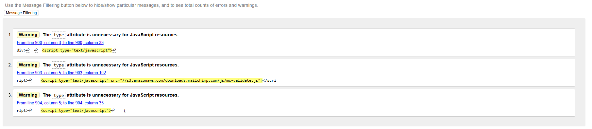

⚠️ *Known Issue: HTML Validation Error Due to Duplicate IDs
Description on Profile Page:*

An HTML validation error occurs on the profile page because the page includes two Address forms — one for delivery address and one for shipping address. Both forms are rendered using 

    ```
    {{ form.field_name|as_crispy_field }}
    ```
which causes duplicate id attributes on the generated `<div>` wrappers for some fields.

#### CSS Validation
| File | Result |
| :---: | :---: |
| /bag/css/bag.css | Pass |
| /checkout/css/checkout.css | Pass |
| user_profile/css/profile.css | Pass |
| /supplies/css/supplies.css | Pass |
| /css/style.css | Pass |

---

### JavaScript Validator

[JS Hint](https://jshint.com/) was used to validate the JavaScript.

| File | Result |
| :---: | :---: |
| /checkout/js/stripe_elements.js | Pass |
| /js/main.js | Pass |
| /supplies/js/supplies.js | Pass |

*All files are passed with some warnings. let, const, for of and array functions (filter, find, every, map) are only available in ES6.*

---

### Python Validator

[Code Institute Python Linter](https://pep8ci.herokuapp.com/) was used to validate the python files.

*Just E501 line too long warnings was found*
---

### Lighthouse

I used Lighthouse within the Chrome Developer Tools to test the performance, accessibility, best practices and SEO of the website.

**Homepage**

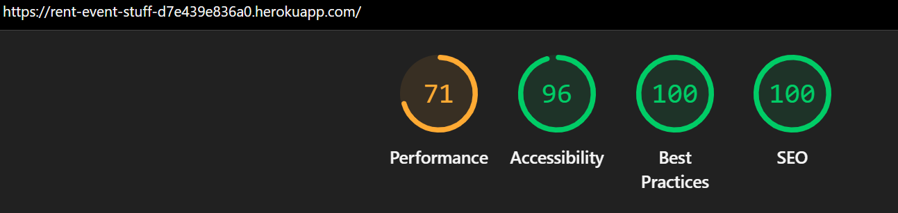

**Supplies**

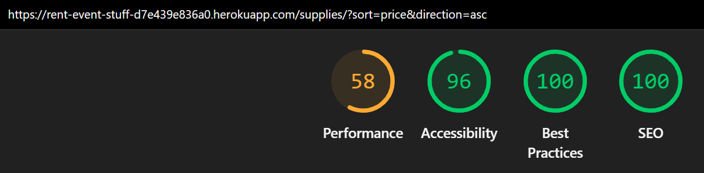

**Supply detail**

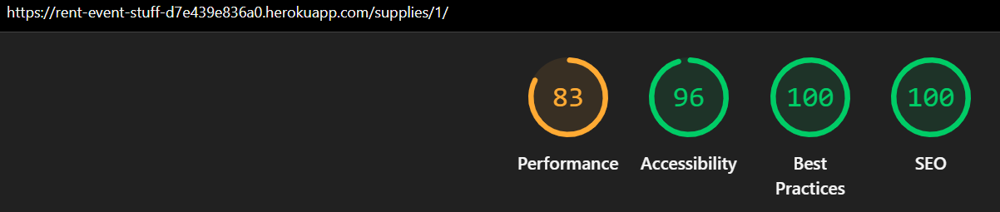

**Bag**

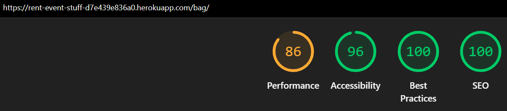

**Checkout**

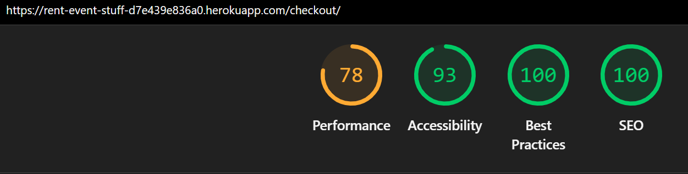

**Checkout Success**

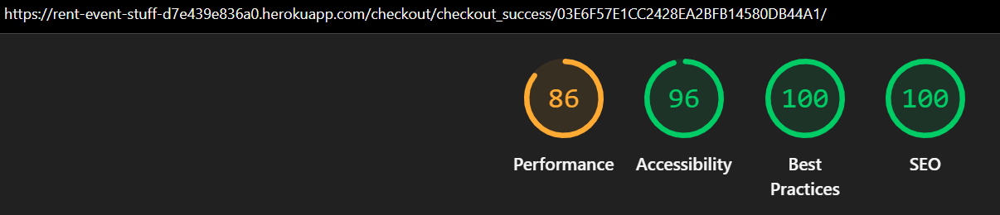

**Login**

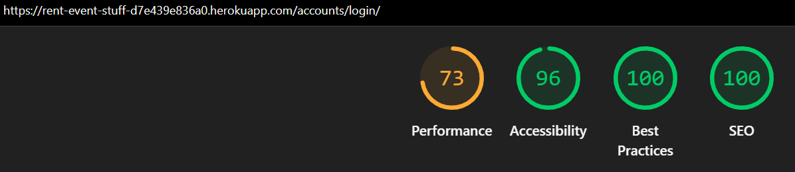

**Logout**

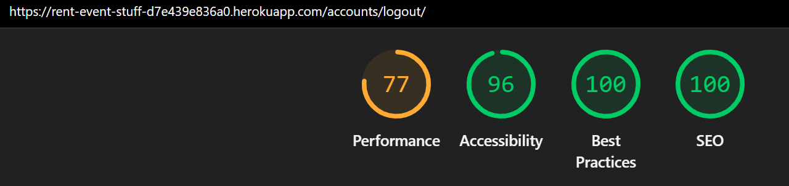

**Register**

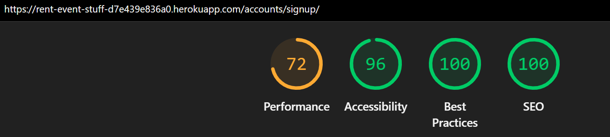

**Verify Email**

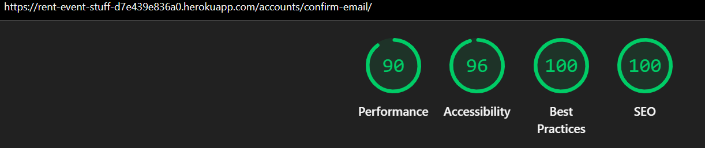

**Reset Password**

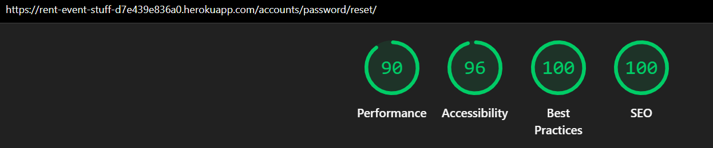

**Reset Password Send**

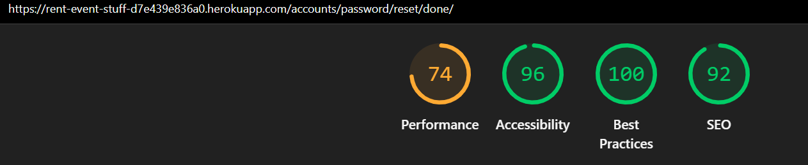

**Profile**

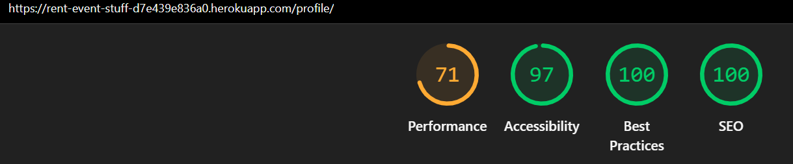

**Add Supply**

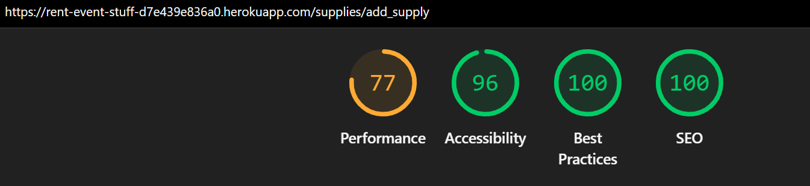

**Edit Supply**


**Privacy Policy**

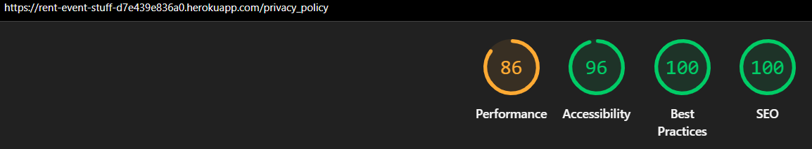

**404 Not Found Page**

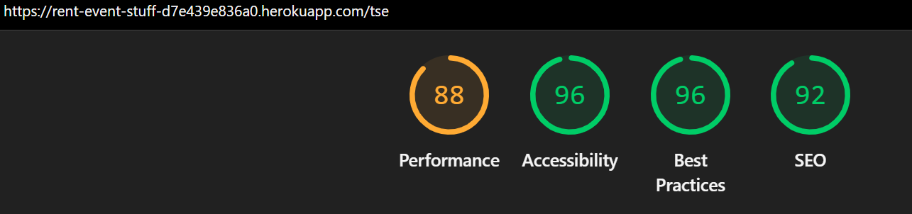


- - -

## Manual Testing

### Testing User Stories
| User Story ID | As a/an | I want to be able to | So that I can... | How is this achieved? |
| :---- | :------------- | :----------------------------- | :-----------------------| :---------------------------------- |
| 1 | *Guest/User* | **View a list of available supplies on the supplies page** | *Browse supply listings and explore what’s available* | Supplies page shows all available supplies, pulled from the database. |
| 2 | *Guest/User* | **Filter supply by category** | *Quickly narrow down listings to what suits my interests* | Category filter on supplies page allows narrowing by type (e.g., Chairs, Tables). |
| 3 | *Guest/User* | **Search for a supply by name, description** | *Find a specific supply I'm interested in* | Search bar on header of each page queries name and description fields to return matching supplies.|
| 4 | *Guest/User* | **Click on a supply to view detailed information** | *Learn more about the supply's features and specifications* | Clicking a supply leads to a detail view with full info and images. |
| 5 | *Guest/User* | **View supply images in the detail page** | *Visually assess the condition and style of the supply* | Images are shown in a bootstrap carousel on the supply detail page. |
| 6 | *User* | **View reviews and ratings on supply** | *See others experience* | Detail page includes reviews left by other users apears just for logged in users. |
| 7 | *User/Guest* | **View the privacy policy of the website** | *Understand how my data is collected and used* | Privacy policy is accessible from the footer and dedicated page. |
| 8 | *User/Guest* | **Add supplies to my bag** | *Collect items I want to rent before checkout* | Each supply has an 'Add to Bag' button storing selections in session. |
| 9 | *User/Guest* | **View, update, or delete items in my bag** | *Manage my selections before placing an order* | Bag page allows editing quantities or removing items. |
| 10 | *User* | **Save or unsave a supply** | *Express interest on a Supply* | Heart icon toggles saved status; saved items stored in user profile. |
| 11 | *User* | **Add a review on a rented supply** | *Share thoughts directly on the supply* | Review form available on supply detail page after completing an order. |
| 12 | *User* | **Delete or edit my review** | *Correct or remove what I have written* | Review list shows edit/delete options for the review owner. |
| 13 | *User* | **See a list of supplies I’ve saved** | *Review my favorites later* | Saved supplies accessible from user dashboard. |
| 14 | *Guest/User* | **Subscribe to the newsletter via Mailchimp** | *Receive updates, promotions, and news about event supplies* | Mailchimp form integrated into footer and subscribe embedded form. |
| 15 | *User/Guest* | **Securely proceed to checkout and fill in payment information**  | *Complete my rental order* | Stripe Checkout is launched after filling the order form. |
| 16 | *User* | **Save my address information from payment as a default** | *Reuse it for faster future checkouts* | Address saved in user profile and prefilled during next checkout. |
| 17 | *User/Guest* | **Receive a success response after payment** | *Know my payment was processed successfully* | Success page shown and confirmation email sent. |
| 18 | *Business* | **Handle unsaved orders via webhook after successful payment** |*Ensure order records are completed and accurate* | Stripe webhook endpoint handles and finalizes payment session. |
| 19 | *User* | **Receive an email notification after successful payment** | *Get proof of payment and rental confirmation* | Email sent using Django’s SMTP setup with order summary. |
| 20 | *Guest* | **Register for an account** | *Show orders history, saved items and interact with the platform* | Registration form available in header dropdown. |
| 21 | *User* | **Log in and out** | *Access and secure my personal account* | Login/logout handled via Django auth system. |
| 22 | *User* | **View and edit my profile** | *Update my information anytime* | Profile page allows editing user details and preferences. |
| 23 | *User* | **View my saved items** | *See listings I’ve saved* | Saved items shown on the profile page. |
| 24 | *Guest* | **Reset my password** | *Regain access to my account if I forget my credentials | Password reset flow handled via Django built-in views. |
| 25 | *Guest* | **Sign in using social media(Google)** | *Quickly register without filling in a full form* |  Google OAuth via django-allauth integration. |
| 26 | *Guest* | **Receive an email notification to activate my account after registration** | *Confirm my identity and start using my account* | Activation email sent via Django email backend. |
| 27 | *User* | **Receive an email notification to reset my password** | *Recover access if I forget my login credentials* | Reset link sent using Django’s password reset system. |
| 28 | *Guest/User* | **Access the Facebook page for the business** | *Stay connected, see updates, and engage with the brand* |  Facebook icon/link in footer. |
| 29 | *Business* | **Implement SEO meta tags** | *Improve search engine visibility and attract more visitors* | SEO tags added to head section using template tags. |
| 30 | *Business* | **Add robots.txt and sitemap.xml** | *Help search engines index the site effectively* | robots.txt and sitemap.xml configured in root URLs. |
| 31 | *Admin* | **Manage supply categories** | *Keep the list of supply types organized and relevant* | Categories can be created/edited in Django admin. |
| 32 | *Admin* | **Manage all supplies** | *Create, list, edit, delete in appropriate listings* | Admin panel provides full CRUD for supplies. |
| 33 | *Admin* | **Change order status** | *Inform user of the current order status* | Order model includes status updates editable in admin. |
| 34 | *Admin* | **Manage reviews** | *Remove harmful or spam reviews* | Admin interface allows moderation of all reviews. |
| 35 | *Admin* | **Access a customized dashboard** | *Efficiently manage the site from a central panel* | Admin dashboard customized with django-admin-interface or Jazzmin. |
| 36 | *All* | **See toast messages for server feedback** | *Instantly understand the success or failure of actions* | Toasts shown using JS ad bootstrap. |
| 37 | *User* | **Confirm deletion actions with a modal** | *Avoid accidentally deleting content* | JS modal prompts before destructive actions. |
| 38 | *User* | **See a loader during javascript operations** | *Know that a background action is in progress* | Spinner or loader appears during async operations using JS. |

- - -

### Full Testing

Full testing was performed on the following devices:

* Laptop:
  * HP Laptop 17 2021
* Mobile Devices:
  * iPhone 14 pro max.
  * samsung A53.

Each device tested the site using the following browsers:

* Google Chrome
* Safari
* Microsoft Edge

**Additional Test**

`Base Template`

| Feature | Expected Outcome | Testing Performed | Result | Pass/Fail |
| ----------- | --------- | --------- | ----------------- | --------- |
| Navbar - Logo | Clicking the logo redirects to the home page. | Clicked logo | Redirects to home page. | Pass |
| Mobile Navbar - Home Link | Click navigates to homepage. | Clicked Home | Redirects to homepage. | Pass |
| Navbar - Sign in/Sign up links | Appear when user is not logged in. | Verified as guest | Sign in and Sign up shown. | Pass |
| Navbar - Profile/Logout links | Appear after logging in. | Logged in and clicked profile icon | Profile and Logout dropdown shown. | Pass |
| Navbar - Admin Panel link | Appears only when admin is logged in. | Logged in as admin | Admin Panel link is visible on profile dropdown menue. | Pass |
| Navbar - Manage Supply link | Appears only when admin is logged in. | Logged in as admin | Manage Supply link is visible on profile dropdown menue. | Pass |
| Search bar on header | Filters supplies based on keyword | Searched for "chairs" | Only chairs displayed | Pass |
| Bag icon on header | Bag icon on the header is visible with the grandtotal price, and displays bag details on click  | Bag icon is visible and icon clicked | diplays bag items and Total prices | Pass |
| Supplies Navigation Links on Header | Displays navigation links according to the top categories and sorting. On click on any link, the supplies are displayed sorted or filtered according to the selected category. | Navigation list is shown on header, and  click on any link works | diplays supplies list sorted or filterd by clicked link | Pass |
| Toaster feedback | Shows messages on actions | Loggedin/Loggedout user, add to bag, update bag, add review, update profile, save/unsave items, error message | Success toaster shown | Pass |
| Footer | Displays contact info and subscribe form. | Scrolled to footer | Footer visible with correct info. | Pass |
| Subscribe | Subscribe form is visible on footer | Email was enterd to subscribe and send icon was clicked |The email has been added to the audience in the Mailchimp account and the response was shown above subscribe form | Pass |
| Privacy Policy Link | Privacy Policy link is visible on footer and works | Scrolled to footer and clicked the link | The privacy policy page was loaded with all information. | Pass |


`Home Page`

| Feature | Expected Outcome | Testing Performed | Result | Pass/Fail |
| ----------- | --------- | --------- | ----------------- | --------- |
| Discover Button | Discover Buttos is visible on Hero section of homepage | Visited homepage and the Discover button is visible and the click works | Discover button was clicked, the supply list page displayed with all supplies and filters  | Pass |


`Supplies Page`
| Feature | Expected Outcome | Testing Performed | Result | Pass/Fail |
| ----------- | --------- | --------- | ----------------- | --------- |
|Supplies page loads all supplies | User can browse supplies with filters, sort and search | Visited supplies page | Supplies are displayed correctly with filters, sort and search working | Pass |
| Filter | Filters supplies based on category  | Selected "chairs" category | all chairs shown only | Pass |
| Sort by | Sort supplies based on price, category, name  | Selected "sort by price(low to high)" | dislayed supplies sorted by "sort by price(low to high)" | Pass |
| Supply Detail | Navigates to supply detail page | Clicked on a supply name or image | Redirected to supply detail with full info | Pass |
| Pagination | Works with more than 24 supplies. | Tested 24+ supplies | Pagination navigates correctly. | Pass |
| Supply Edit/Delete | Allowed only for Admin user. | Login as Admin and navigate to supplies pages | Buttons visible. | Pass |
| Supply edit clicked | Navigates to supply edit page | Clicked on edit button | Supply edit page was loaded | Pass |
| Supply delete clicked | Shows the delete confirmation modal | Clicked on delete button | Supply delete modal was loaded | Pass |
| Confirm delete clicked | Deletes supply | Clicked on confirm delete button | Supply was deleted | Pass |


 `Supply Detail Page`

| Feature | Expected Outcome | Testing Performed | Result | Pass/Fail |
| ------- | -------------------------- | --------------- | ----------- | --------- |
| Supplies details visible | Shows names, images, description, price, rating | Opened a supply page | All info displayed | Pass |
| Add to bag form  | Add to bag form is visible and works | Added valid quantity, renting date and renting days and clicked add to bag button | The item added to bag and success message was shown | Pass |
| Keep Shopping button  | Keep Shopping button is visible and works | Clicked on Keep Shopping button | Redirected to the supplies page | Pass |
| Reviews box | Visible only for logged in users | logged in | review box was visible | Pass |
| Save Item button | Enabled for logged in users | Logged in and clicked heart icon | Item saved/unsaved successfully | Pass |
| Add review  | Submit review  button is active only if the user is logged in and rentend the supply before | Logged in and navigate to a rented supply | The submit review button is activated | Pass |
| Edit button on review  | Edit review button is visible only if user owns the review and works | Added review and clicked the edit buttons | The review displayed on review form so the user can edit it | Pass |
| Submit review button  | Creates/updates a review | Filled the review form and clicked submit review button | The review was created or updated | Pass |
| Delete button on review  | Delete review button is visible only if user owns the review and works | Added review and clicked the delete buttons | Confirm delete modal was shown | Pass |
| Confirm delete review button  | Deletes review  | Clicked on confirm delete button | Rewiew was deleted | Pass |


 `Bag Page`

| Feature | Expected Outcome | Testing Performed | Result | Pass/Fail |
| ------- | -------------------------- | --------------- | ----------- | --------- |
| Bag details visible | Shows items, price per day, quantity form, subtotal and total prices | Navigated to the bag page | All info displayed | Pass |
| Edit quantity form  | Quantity form visible for each item and works | Quantity forms were shown for each bag item and edited item quantity and clicked update button | The quantity of the item updated and success message was shown | Pass |
| Delete item  | Delete button is visible for each item and works | the delete button was displayed for each item and works | On click, the item was deleted | Pass |
| Secure Checkout button  | Secure Checkout button is visible and works | Clicked on Secure Checkout button | The item was deleted | Pass |
| Keep Shopping button  | Keep Shopping button is visible and works | Clicked on Keep Shopping button | Redirected to the supplies page | Pass |


 `Checkout Page`

| Feature | Expected Outcome | Testing Performed | Result | Pass/Fail |
| ------- | -------------------------- | --------------- | ----------- | --------- |
| Redirect to Checkout page | Access Checkout page only if the bag is not empty | Added Items to bag and Navigated to checkout page | Checkout page was loaded | Pass |
| Bag details visible | Shows items, price per day, quantity, subtotal and total prices | Opened a checkout page | All info displayed | Pass |
| Payment form visible  | Payment form visible and works | Navigated to the checkout page and Filled the payment form | The validation and submition values worked successfully | Pass |
| Save delivery information button  | Save info button is visible  and works only for logged in users |  Save delivery button clicked | Add save info key to checkout cache | Pass |
| Card error is visible | Displays errors on payament card input | Enterd none valid card number or information | The error message was shown | Pass |
| Complete order button  | Complete order button is visible and works | Filled the payment form successfully and clicked on Complete order button | The order was created, cache informations was saved to session and redirected to checkout success page | Pass |
| Adjust bag button  | Adjust bag button is visible and works | Clicked on Adjust bag button | Redirected to the bag page | Pass |


 `Payment Completed`

| Feature | Expected Outcome | Testing Performed | Result | Pass/Fail |
| ------- | -------------------------- | --------------- | ----------- | --------- |
| Create Order | Create order using webhook handler if the order wasn't created after payment | Payment Completed and فhe order was not generated because the window was closed before completion. | The order was generated using webhook handler and saved info to user profile for loggedin user and checked save info | Pass |
| Send order confirmation email | Sends Email after placing an order | Order successfully placed | Confirmation email was sent | Pass |


 `Checkout Success Page`

| Feature | Expected Outcome | Testing Performed | Result | Pass/Fail |
| ------- | -------------------------- | --------------- | ----------- | --------- |
| Order details visible | Shows Order nummber, date, status, items, prices | Redirected to a checkout page after successfully payment | All info displayed | Pass |
| Now check out the latest deals button | The button is visible and works | Navigated to the checkout success page and Clicked the button | Redirected to supplies page | Pass |


`Sign In Page`

| Feature | Expected Outcome | Testing Performed | Result | Pass/Fail |
| ------  | ---------------- | ----------------- | -------| --------- |
| Sign In Form - Fields | Shows fields for username and password. | Opened page | Both input fields present. | Pass |
| Sign In Form - Validation  | Empty/Wrong entry fields display error. | Submitted with empty or wrong info fields | Validation error shown. | Pass |
| Link to Sign Up | Redirects to Sign Up page. | Clicked link | Redirected to Sign Up page. | Pass |
| Link to Forget Password | Redirects to Forget Password page. | Clicked link | Redirected to Forget Password  page. | Pass |
| Login with Google | Redirects to Login with Google page. | Clicked link | Redirected to Login with Google page. | Pass |
| Successful Login | Redirects to home and shows toaster. | Entered valid credentials | Redirected to home with success toast: "Successfully logged in." | Pass |

`Sign Up Page`

| Feature | Expected Outcome | Testing Performed | Result | Pass/Fail |
| ------  | ---------------- | ----------------- | -------| --------- |
| Sign Up Form - Fields | Shows fields for username, email, password, confirm password. | Verified form | All fields present. | Pass |
| Sign Up Form - Validation  | Empty or mismatched passwords show error. | Tried various invalid inputs | Errors displayed. | Pass |
| Link to Sign In | Redirects to Sign In page. | Clicked link | Redirected to Sign In. | Pass |
| Register with Google | Redirects to Register with Google page. | Clicked link | Redirected to Register with Google page. | Pass |
| Successful Registration | Redirects to home and logs in user. | Submitted valid form | Redirected to home with success toast: "Account created and logged in." | Pass |

`Sign Out Page`

| Feature | Expected Outcome | Testing Performed | Result | Pass/Fail |
| ------  | ---------------- | ----------------- | -------| --------- |
| Confirmation Message | Displays logout confirmation message. | Navigated to Sign Out | Message visible with logout button. | Pass |
| Logout Button | Logs user out and redirects to homepage. | Clicked logout | User redirected to home. | Pass |


`Profile Page`

| Feature | Expected Outcome | Testing Performed | Result | Pass/Fail |
| ------ | ------------ | ----------- | ------------------ | -------- |
| Tab list | Shows links to Order List and Saved Items | Load Profile Page | Order List and Saved Items were visible as tab list | Pass |
| Profile Form | Editable forms for mobile form and delivery and shipping address. | Updated data | Data saved successfully. | Pass |
| Order number link | Redirects to order history page. | Clicked link | Redirected to order history. | Pass |
| Saved item name link | Redirects to supply detail page. | Clicked link | Redirected to supply detail page. | Pass |


 `Order History Page`

| Feature | Expected Outcome | Testing Performed | Result | Pass/Fail |
| ------- | -------------------------- | --------------- | ----------- | --------- |
| Order details visible | Shows Order nummber, date, status, items, prices | Redirected to a order history page from profile page | All info displayed | Pass |
| Back to profile button | The button is visible and works | Navigated to the order history page and Clicked the button | Redirected to profile page | Pass |

`404 page`

| Feature  | Expected Outcome | Testing Performed | Result | Pass/Fail |
| -------- | ------------- | ---------- | ----------------- | -------- |
| Navigate to non existing page | Redirects to 404 page with a message. | Accessed not exist page | Custom error page was loaded. | Pass |
| Return to shop button | Redirects to home page. | Clicked button | Redirects to homepage. | Pass |


- - -

## Bugs

### Solved Bugs

|  No | Bug | How I solved the issue |
| :-: | :------------ | :----------: |
|  1  |The address form on the checkout page was rendered twice — once for the mobile version and once for the desktop version. As a result, the address and payment card elements were added to the DOM twice, causing some fields to have duplicate IDs.| I’ve fixed this by rendering the form only once in the DOM and dynamically moving it to the appropriate container based on the window size using JavaScript. |
|  2  |  Image wasn’t visible when sharing to Facebook | I fixed the image URL by prepending the media folder to the image name |
|  3  | SEO Lighthouse was showing a warning that the canonical URL must be equal to the page URL on some pages.| I added a context_processor to dynamically generate the correct canonical URL for each page |

### Known bugs 

|  No | Bug | Planned Solution |
| :-: | :---- | :------- |
| 1  | Image preview for admin uploads does not work. | Will add JavaScript-based image preview logic to the admin form similar to user upload functionality. |
| 2 | Homepage video, Supply images on supplies page and images on supply detail slowing load time. | Optimize image and video sizes to improve performance. |
| 3 | Console warning during deployment indicates that one or more third-party services are not allowed to use cookies. | Add a cookie consent mechanism to the website to comply with browser and privacy requirements. |
| 4 |  HTML validation errors appeared on the profile page due to using the same form for both delivery and shipping info, which caused duplicate div IDs. | Redesigned the delivery and shipping address update sections to avoid duplicated element IDs |